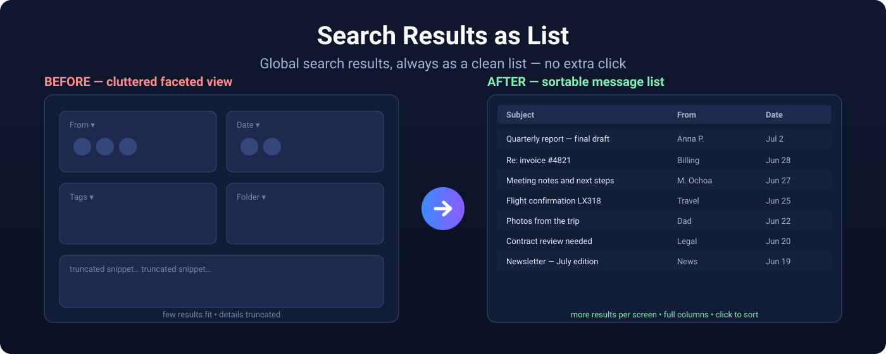

# Search Results as List (Thunderbird)

🇬🇧 **English** | 🇩🇪 [Deutsch weiter unten](#-deutsch)



Makes Thunderbird's **global search** (Gloda) show results **immediately as a
message list** — instead of the cluttered faceted/card view that requires a
manual click on "Show results as list" every single time.

A modern replacement for the old "Search as list" add-on, which only worked up
to Thunderbird 60. Compatible with **Thunderbird 128, 140, 152 and newer**.

## How it works

There is no official WebExtension API for this, so the add-on uses a small
**Experiment API**. It hooks into `tabmail.openTab` in every mail window.
Whenever Thunderbird is about to open a `glodaFacet` view, the add-on instead
opens the equivalent list view (`mail3PaneTab` with a `GlodaSyntheticView`) —
exactly the same mechanism the built-in "Show results as list" button uses.

It also sets the preference `gloda.facetview.show_as_list_by_default` to
`true`. This does nothing on Thunderbird ≤ 152 (harmless), and on
Thunderbird 154+ it makes Thunderbird switch natively on its own.

**Privacy:** collects nothing, transmits nothing, contacts no servers. 100%
offline — it only changes how existing local search results are displayed.

## Install (permanent)

Because this is an Experiment API add-on and isn't signed yet, Thunderbird
needs to allow unsigned extensions:

1. **Tools → Settings → General → Config Editor…** (`about:config`).
2. Find `xpinstall.signatures.required` and set it to **`false`**.
3. Build the `.xpi` from this folder (see "Packaging" below), or use the one
   already included: `search-results-as-list.xpi`.
4. **Tools → Add-ons and Themes → gear ⚙ → Install Add-on From File…** and
   select the `.xpi`.
5. Restart Thunderbird.

## Install (temporary, to try it without changing settings)

Lasts until the next restart — great for testing:

1. Open `about:debugging` (or menu **☰ → Tools → Developer Tools → Debug
   Add-ons**).
2. **"This Thunderbird" → "Load Temporary Add-on…"**.
3. Select **`manifest.json`** in this folder.

## Packaging (building the .xpi)

A `.xpi` is just a ZIP archive whose **contents** (not the enclosing folder)
sit at the top level — `manifest.json` must be at the ZIP root.

**Windows PowerShell** (run inside this folder):

```powershell
Compress-Archive -Path .\manifest.json,.\background.js,.\icon.svg,.\api `
  -DestinationPath .\search-results-as-list.zip -Force
Rename-Item .\search-results-as-list.zip search-results-as-list.xpi -Force
```

## Uninstall / disable

Through **Add-ons and Themes** like any other add-on. Disabling restores the
original search behavior. The `gloda.facetview.show_as_list_by_default` pref
stays set; reset it to `false` in `about:config` if you want.

## Files

| File | Purpose |
|------|---------|
| `manifest.json` | Add-on manifest (MV2, Experiment API). |
| `background.js` | Starts the Experiment API. |
| `api/searchAsList/schema.json` | Defines the `searchAsList.register()` API. |
| `api/searchAsList/implementation.js` | The actual logic (privileged). |
| `icon.svg` | Add-on icon. |
| `LISTING.md` | Ready-to-paste store listing copy (EN + DE). |
| `SUBMISSION.md` | Step-by-step guide for publishing on addons.thunderbird.net. |

## Notes / limitations

- **Not tested against a live Thunderbird install in this environment.** The
  code is based on the current Thunderbird source (comm-central), but internal
  APIs can shift between versions. If something breaks, check the **Error
  Console** (Tools → Developer Tools → Error Console) for lines starting with
  `[Search Results as List]`.
- **Combined message + chat searches** are intentionally left in the faceted
  view so chat results are never dropped.
- If building the list view ever fails, the add-on automatically falls back to
  the normal faceted view — search never breaks.

## License

MIT — see [LICENSE](LICENSE). Contributions and bug reports welcome.

## Support development

💛 If this add-on saves you time, a small donation is always appreciated — but never required: [paypal.me/hk2325](https://paypal.me/hk2325).

---

# 🇩🇪 Deutsch

Macht in Thunderbird die **globale Suche** (Gloda) so, dass die Ergebnisse
**immer sofort als Nachrichtenliste** erscheinen – statt der überladenen
Facetten-/Kachelansicht, bei der man jedes Mal manuell auf
„Ergebnisse als Liste anzeigen" klicken muss.

Ein moderner Ersatz für das alte Add-on „Search as list", das nur bis
Thunderbird 60 funktionierte. Kompatibel mit **Thunderbird 128, 140, 152 und
neuer**.

## Wie es funktioniert

Für diese Funktion gibt es keine offizielle WebExtension-API, daher nutzt das
Add-on eine kleine **Experiment-API**. Sie klinkt sich in jedem Mail-Fenster in
`tabmail.openTab` ein. Sobald Thunderbird eine `glodaFacet`-Ansicht öffnen
möchte, öffnet das Add-on stattdessen die passende Listenansicht
(`mail3PaneTab` mit einer `GlodaSyntheticView`) – exakt derselbe Mechanismus,
den auch der eingebaute Knopf „Ergebnisse als Liste anzeigen" verwendet.

Zusätzlich wird die Einstellung `gloda.facetview.show_as_list_by_default` auf
`true` gesetzt. Auf Thunderbird ≤ 152 tut die nichts (schadet aber auch nicht),
auf Thunderbird 154+ erledigt Thunderbird die Umschaltung damit von selbst.

**Datenschutz:** sammelt nichts, überträgt nichts, kontaktiert keine Server.
100 % offline – verändert ausschließlich die Darstellung bereits vorhandener
lokaler Suchergebnisse.

## Installieren (dauerhaft)

Weil das Add-on eine Experiment-API ist und (noch) nicht signiert, muss
Thunderbird unsignierte Erweiterungen zulassen:

1. **Extras → Einstellungen → Allgemein → Konfiguration bearbeiten…**
   (about:config).
2. `xpinstall.signatures.required` suchen und auf **`false`** setzen.
3. Die im Ordner bereits enthaltene Datei `search-results-as-list.xpi`
   verwenden (oder neu bauen, siehe „Paketieren" unten).
4. **Extras → Add-ons und Themes → Zahnrad ⚙ → Add-on aus Datei
   installieren…** und die `.xpi` auswählen.
5. Thunderbird neu starten.

## Installieren (temporär, zum Testen ohne Signaturänderung)

Läuft nur bis zum nächsten Neustart, ideal zum Ausprobieren:

1. Adresse `about:debugging` öffnen (oder Menü **☰ → Extras →
   Entwicklertools → Debugging von Add-ons**).
2. **„Dieser Thunderbird" → „Temporäres Add-on laden…"**.
3. Die Datei **`manifest.json`** in diesem Ordner auswählen.

## Paketieren (.xpi erstellen)

Eine `.xpi` ist nur ein ZIP-Archiv, dessen **Inhalt** (nicht der umschließende
Ordner!) auf oberster Ebene liegt – `manifest.json` muss also direkt im
ZIP-Wurzelverzeichnis stehen.

**Windows PowerShell** (in diesem Ordner ausführen):

```powershell
Compress-Archive -Path .\manifest.json,.\background.js,.\icon.svg,.\api `
  -DestinationPath .\search-results-as-list.zip -Force
Rename-Item .\search-results-as-list.zip search-results-as-list.xpi -Force
```

## Deinstallieren / Deaktivieren

Über **Add-ons und Themes** wie jedes andere Add-on. Beim Deaktivieren stellt
das Add-on das ursprüngliche Suchverhalten wieder her. Die gesetzte
Einstellung `gloda.facetview.show_as_list_by_default` bleibt bestehen; bei
Bedarf in about:config zurück auf `false` setzen.

## Dateien

| Datei | Zweck |
|-------|-------|
| `manifest.json` | Add-on-Manifest (MV2, Experiment-API). |
| `background.js` | Startet die Experiment-API. |
| `api/searchAsList/schema.json` | Definiert die `searchAsList.register()`-API. |
| `api/searchAsList/implementation.js` | Die eigentliche Logik (privilegiert). |
| `icon.svg` | Add-on-Symbol. |
| `LISTING.md` | Fertiger Store-Beschreibungstext zum Einfügen (EN + DE). |
| `SUBMISSION.md` | Schritt-für-Schritt-Anleitung für addons.thunderbird.net. |

## Hinweise / Grenzen

- **In dieser Umgebung nicht gegen eine laufende Thunderbird-Installation
  getestet.** Der Code basiert auf dem aktuellen Thunderbird-Quellcode
  (comm-central); interne APIs können sich zwischen Versionen ändern. Bei
  Fehlern in die **Fehlerkonsole** schauen (Extras → Entwicklertools →
  Fehlerkonsole) nach Zeilen mit `[Search Results as List]`.
- **Kombinierte Nachrichten-+-Chat-Suchen** werden bewusst weiterhin in der
  Facettenansicht geöffnet, damit keine Chat-Treffer verloren gehen.
- Sollte das Erstellen der Liste einmal fehlschlagen, fällt das Add-on
  automatisch auf die normale Facettenansicht zurück – die Suche geht also nie
  kaputt.

## Lizenz

MIT — siehe [LICENSE](LICENSE). Beiträge und Fehlermeldungen willkommen.

## Entwicklung unterstützen

💛 Wenn dir dieses Add-on Zeit spart, freue ich mich über eine kleine Spende — völlig freiwillig: [paypal.me/hk2325](https://paypal.me/hk2325).
