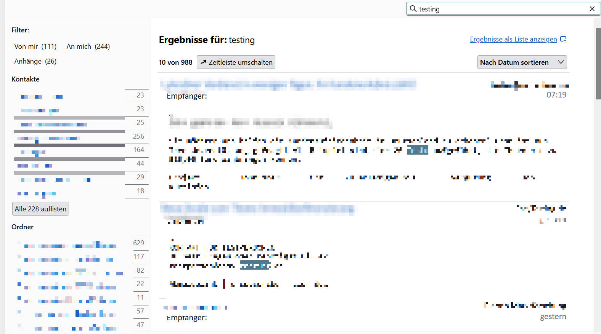
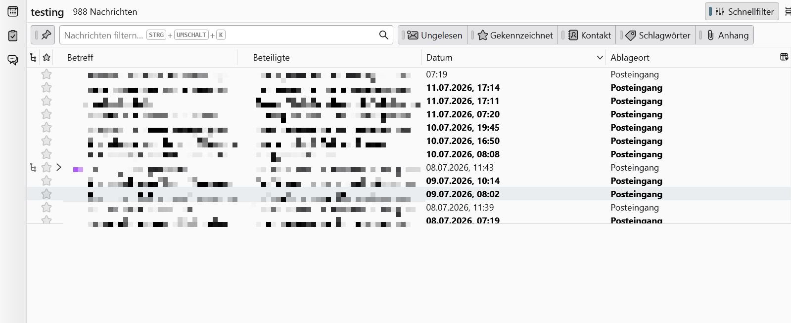

# Search Results as List (Thunderbird)

🇬🇧 English | 🇩🇪 [Deutsch](#deutsch)

Thunderbird's global search always opens in the cluttered faceted view, and you
have to click "Show results as list" every single time. This add-on makes the
list the default.

**Before:**

**After:**

Works with **Thunderbird 128, 140, 152 and newer**. Collects no data, contacts
no servers.

## Install

1. **Tools → Settings → Config Editor**, set `xpinstall.signatures.required`
   to `false`
2. Download [search-results-as-list.xpi](search-results-as-list.xpi)
3. **Tools → Add-ons and Themes → ⚙ → Install Add-on From File…**
4. Restart Thunderbird

To try it without changing settings (until next restart): `about:debugging` →
"This Thunderbird" → "Load Temporary Add-on…" → pick `manifest.json`.

## How it works

There is no WebExtension API for this, so the add-on uses a small Experiment
API. It wraps `tabmail.openTab`: when Thunderbird is about to open a
`glodaFacet` tab, it opens the equivalent list tab (`mail3PaneTab` with a
`GlodaSyntheticView`) from the same query — the same thing the built-in
"Show results as list" button does.

Chat messages are not included in the list view, same as Thunderbird's own
native list view. If anything fails, it falls back to the faceted view, so
search never breaks.

From **Thunderbird 154** this is built in
([bug 580252](https://bugzilla.mozilla.org/show_bug.cgi?id=580252)), so this
add-on is a bridge for 128–153.

Not on addons.thunderbird.net because new add-ons using Experiment APIs are
not being reviewed there at the moment.

## Troubleshooting

Check **Tools → Developer Tools → Error Console** for lines starting with
`[Search Results as List]`.

## License

MIT. 💛 Optional donation: [paypal.me/hk2325](https://paypal.me/hk2325)

---

# 🇩🇪 Deutsch

Thunderbirds globale Suche öffnet sich immer in der überladenen
Facettenansicht, und man muss jedes Mal auf „Ergebnisse als Liste anzeigen"
klicken. Dieses Add-on macht die Liste zum Standard.

**Vorher:**

**Nachher:**

Funktioniert mit **Thunderbird 128, 140, 152 und neuer**. Sammelt keine Daten,
kontaktiert keine Server.

## Installieren

1. **Extras → Einstellungen → Konfiguration bearbeiten**,
   `xpinstall.signatures.required` auf `false` setzen
2. [search-results-as-list.xpi](search-results-as-list.xpi) herunterladen
3. **Extras → Add-ons und Themes → ⚙ → Add-on aus Datei installieren…**
4. Thunderbird neu starten

Zum Ausprobieren ohne Einstellungsänderung (bis zum Neustart):
`about:debugging` → „Dieser Thunderbird" → „Temporäres Add-on laden…" →
`manifest.json` auswählen.

## Wie es funktioniert

Für diese Funktion gibt es keine WebExtension-API, daher nutzt das Add-on eine
kleine Experiment-API. Sie umschließt `tabmail.openTab`: Sobald Thunderbird
einen `glodaFacet`-Tab öffnen will, öffnet das Add-on stattdessen den passenden
Listen-Tab (`mail3PaneTab` mit `GlodaSyntheticView`) aus derselben Suche —
genau das, was der eingebaute Knopf „Ergebnisse als Liste anzeigen" tut.

Chat-Nachrichten sind in der Listenansicht nicht enthalten, genau wie in
Thunderbirds eigener Listenansicht. Schlägt etwas fehl, wird auf die
Facettenansicht zurückgefallen — die Suche geht also nie kaputt.

Ab **Thunderbird 154** ist das eingebaut
([Bug 580252](https://bugzilla.mozilla.org/show_bug.cgi?id=580252)), das Add-on
ist also eine Brücke für 128–153.

Nicht auf addons.thunderbird.net, weil dort derzeit keine neuen Add-ons mit
Experiment-APIs geprüft werden.

## Fehlersuche

**Extras → Entwicklertools → Fehlerkonsole** öffnen und nach Zeilen mit
`[Search Results as List]` schauen.

## Lizenz

MIT. 💛 Spende (freiwillig): [paypal.me/hk2325](https://paypal.me/hk2325)
